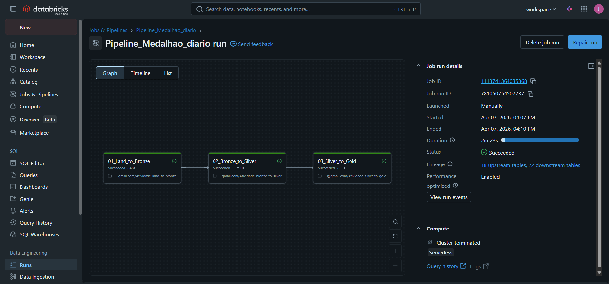

# Pipeline de Dados E-Commerce: Arquitetura Medalhão 🚀

Este projeto foi desenvolvido como parte da atividade de Engenharia de Dados do **Visagio Rocket Lab 2026**. O objetivo principal é estruturar os dados de um grande e-commerce (utilizando o dataset público da Olist), construindo um pipeline ETL completo e escalável no Data Lakehouse do **Databricks**.

O projeto implementa a **Arquitetura Medalhão (Medallion Architecture)**, processando os dados desde seu estado bruto até a criação de Data Marts analíticos para a extração de KPIs de negócio.

---

##  Arquitetura do Projeto

O pipeline foi construído dividindo o processamento em três camadas principais:

###  Camada Bronze (Ingestão e Preparação)
**Arquivo:** `Atividade_land_to_bronze.ipynb`
* **Objetivo:** Extrair os dados brutos (arquivos CSV) armazenados no Volume do Databricks e carregá-los como tabelas no banco de dados `bronze`.
* **Tratamento:** Adição da coluna de rastreabilidade `timestamp_ingestion`, registrando o momento exato da ingestão do dado.

###  Camada Silver (Limpeza e Otimização)
**Arquivo:** `Atividade_bronze_to_silver.ipynb`
* **Objetivo:** Refinar os dados da camada Bronze, preparando-os para as regras de negócio.
* **Tratamento:** Limpeza de inconsistências, deduplicação de registros e formatação de esquemas.
* **Performance:** Aplicação de otimização física das tabelas fato utilizando os comandos `OPTIMIZE` e `ZORDER`, garantindo alta performance para as consultas na camada seguinte.

###  Camada Gold (Data Marts e KPIs)
**Arquivo:** `Atividade_silver_to_gold.ipynb`
* **Objetivo:** Disponibilizar os dados prontos para o consumo das áreas de negócio.
* **Tratamento:** Gravação no modo *overwrite*. Geração de insights de avaliação de e-commerce.
* **KPIs Extraídos:**
    1. O Produto MAIS bem avaliado.
    2. O Produto MENOS bem avaliado.
    3. O Vendedor MAIS bem avaliado.
    4. O Vendedor MENOS bem avaliado.
    *(Critério de desempate: Volume de avaliações em ordem decrescente).*

---

##  Orquestração e Automação

O pipeline é totalmente automatizado utilizando o **Databricks Workflows (Jobs)**. 

* **Arquivo de Configuração:** `job.yaml`
* **Fluxo de Execução:** Sequencial (`Bronze -> Silver -> Gold`).
* **Agendamento (Trigger):** Configurado para rodar diariamente às 13:00 (Fuso horário America/Sao_Paulo).
* **Tolerância a Falhas:** Configurado com `.option("overwriteSchema", "true")` para suportar atualizações e evoluções de esquema.

### Execução do Pipeline
Abaixo está a evidência da execução de sucesso do Job, demonstrando o encadeamento e a dependência correta entre as tarefas:



---

## 🛠️ Tecnologias Utilizadas

* **Plataforma:** Databricks (Data Lakehouse)
* **Linguagens:** PySpark, Python, Spark SQL
* **Arquitetura:** Medallion (Bronze, Silver, Gold)
* **Orquestração:** Databricks Jobs (Workflows)
* **Fonte de Dados:** Kaggle (Olist E-Commerce Dataset)

---

##  Estrutura do Repositório

```text
├── Atividade_land_to_bronze.ipynb   # Notebook de ingestão (Camada Bronze)
├── Atividade_bronze_to_silver.ipynb # Notebook de limpeza (Camada Silver)
├── Atividade_silver_to_gold.ipynb   # Notebook de regras de negócio (Camada Gold)
├── job.yaml                         # Exportação do workflow configurado no Databricks
├── print_run_pipeline.png           # Evidência da execução com sucesso das tasks
└── README.md                        # Documentação do projeto